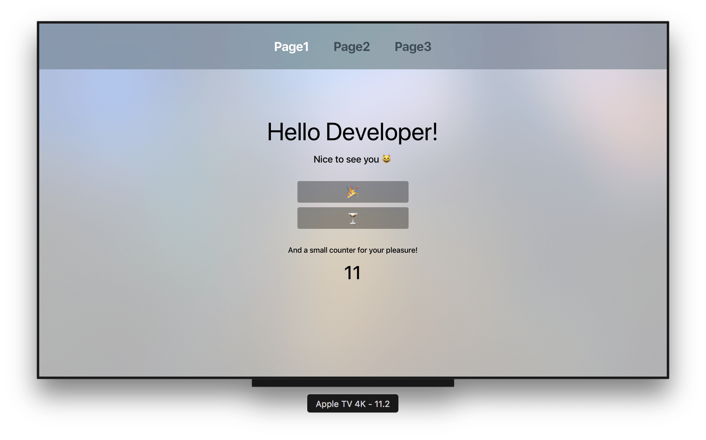

# TVDML Application boilerplate

Basic build configuration to begin building Apple TV apps using [TVDML](https://github.com/a-ignatov-parc/tvdml) library.

## Demo app

Here's a glimpse of what it looks like



## Run demo app

To be able to build application you need `node.js` >= 8.9.0 and `yarn` >= 1.3.0.

> If you are using [nvm](https://github.com/creationix/nvm) there is an `.nvmrc`

To start we need to install all dependencies with `yarn`:

```bash
yarn
```

If you don't have globally installed `yarn` you can install all dependencies using local `yarn` installation:

```bash
npm run install-deps
```

Now you need to start webserver to build and serve TVML app:

```bash
npm run serve
```

> Server will start at [localhost:9001](http://localhost:9001/)

Next step is to open XCode project (`boilerplate.xcodeproj`) located in `xcode` folder and run project with "Play" button at the top left corner or hit <kbd>CMD</kbd> + <kbd>R</kbd>. This will open Apple TV simulator and you'll be able to play around with demo app.

## Build project

In addition to serve application from MemoryFS you can build your application located in `/src` folder:

```bash
npm run build
```

> Results will be placed in `/dist` folder.

To build optimized and minified version use:

```bash
npm run dist
```

## Additional information

Old build configuration based on `gulp.js` can be found in [`gulp` branch](https://github.com/a-ignatov-parc/tvdml-app-boilerplate/tree/gulp).
